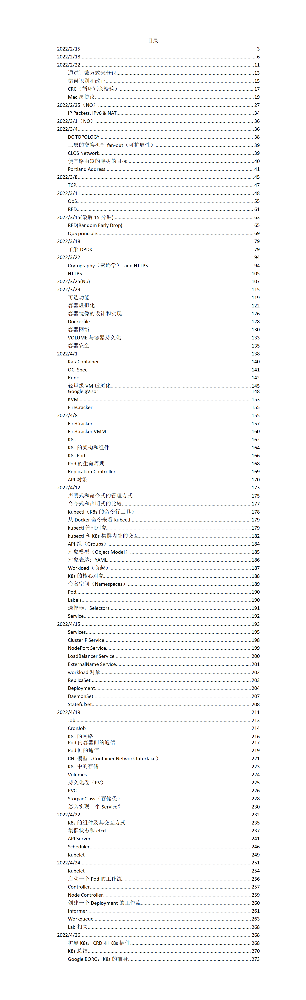

# SE3356-2022-Notes
上海交通大学软件学院课程云操作系统设计与实践(SE3356)笔记

## 课程简介
本课程为高年级本科生的专业课程，从工程级介绍云操作系统与平台的设计与开发技术，作为系统软件方向的综合收口课，融合云系统的设计、架构和优化等部分，进行教学和实践。

本课程首先介绍了计算机网络的基础知识和当前主要进展，并结合多个实验检验学生掌握知识的情况，培养学生的动手能力。然后，本课程介绍云操作系统的基础知识和当前主要进展、以及云系统中的典型架构和基本组件，培养学生对云操作系统的整体认识。课程在介绍了云操作系统基础后，分析了云系统的基本技术及实现技术，包含容器虚拟化技术、云存储、以及通信等技术内容。课程围绕三类云系统架构：传统云服务（Spark等典型系统），微服务计算，以及无服务计算，分析了云操作系统的设计方法、架构、实现等。课程设计了多个云操作系统设计与实现的实践作业，验证和提高学生综合的设计和开发能力。

本课程尤其关注学生的实际动手能力。上课时间主要为教师讲解，整个课程设计了多个课程实践作业，其中包含1个团队作业。既培养了学生个人的技术能力、实践能力，也培养了学生的团队合作能力、口头表达与文字表达的能力。

## 说明

- 由于本课程的期末考核是大作业，所以本笔记并没有完整覆盖所有课程内容。请根据目录和内容仔细判别。欢迎关注我们组的[大作业实现](https://github.com/WilliamX1/minik8s)。
- 因为大部分笔记都是课上所记录，不可避免有疏漏之处，包括上课走神可能遗漏知识点。如果你发现了任何问题，欢迎vx联系我或者提交issue。欢迎你提交自己的补充知识点进来。
- 我想进一步推动软件学院中资料的流通，但我个人很难去以这种质量去维护所有课的笔记。欢迎有愿意分享资料的志愿者同学前往[软院笔记仓库](https://github.com/SJTU-SE/awesome-se-notes)贡献。
- 任何转载请引用这个仓库。

## 目录

